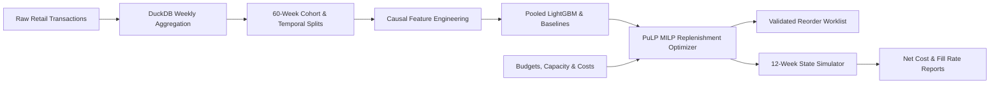

# DemandGuard: Demand Forecasting & Inventory Replenishment Optimisation

[](https://www.python.org/)
[](https://fastapi.tiangolo.com/)
[](https://lightgbm.readthedocs.io/)
[](https://coin-or.github.io/pulp/)
[](https://duckdb.org/)
[](LICENSE)

DemandGuard tests one question: **can a time-aware sales forecast support better weekly purchasing decisions than a simple reorder rule under the same budget and storage limits?** It forecasts four weeks of demand for 30 established products from the UCI Online Retail II data, then uses a mixed-integer program (PuLP/CBC) to recommend whole-unit orders. A 12-week simulation then compares the recommendations against a constrained rule.

**Headline result (honest):** LightGBM beat the 4-week moving average on validation but lost on the 12-week test window. The best optimised policy saved 0.85% of simulated cost against the rule, short of the 5% target. Costs are synthetic scenario units (SCU), not real money. Section 1 has the full objective scorecard; section 6 lists the limitations.




## 1. Project Objectives & Status Audit

| ID | Objective | Description | Target | Achieved Result | Status | Plain Explanation |
| :--- | :--- | :--- | :--- | :--- | :---: | :--- |
| **O1** | Trustworthy Weekly Data | Reconciled, leak-free panel from raw transactions | 100+ weeks, $\ge 10$ SKUs | 102 complete weeks, 30 SKUs, 9,013,090 panel units | ⚠️ **Mostly Met** | Panel is 100% verified. Gap of 358,320 units from clean data (9,371,410) is due to dropping partial boundary weeks (Dec 1–6, 2009 & Dec 5–9, 2011). |
| **O2** | 4-Week Forecasts | Nonnegative, finite multi-step predictions | 100% coverage, breakdown reporting | 480 val + 360 holdout predictions | ⚠️ **Mostly Met** | Predictions exist and are valid; granular breakdowns by horizon and SKU provided in reports. |
| **O3** | ML Forecast Superiority | LightGBM outperforms best simple baseline | $\ge 10\%$ WAPE reduction | Val: +7.76% (0.6200 vs 0.6722)<br>Holdout: -23.0% (0.7107 vs 0.5777)<br>v0.2 M2_q50: val +12.1%; test (exploratory) -9.3% | ❌ **Missed (Stretch)** | **Missed**: v0.1 LightGBM lost to the trailing 4-week mean on the test window. v0.2 cleared 10% on validation only; it also lost on the (already viewed) test window. |
| **O4** | Feasible Orders | Physical & financial constraints strictly respected | 0 breaches, integer orders | 0 capacity breaches, 0 budget violations across all 12 weeks | ✅ **Met** | Pre-demand bounds and committed-order arrival space protection ($I_0 + A_1 + Q_1 \le C$) verified. |
| **O5** | Inventory Cost Reduction | Optimised replenishment reduces total supply chain cost | $\ge 5\%$ cost reduction, $\ge$ fill rate | P1: -0.85% (335.1k vs 338.0k SCU), fill 70.16% vs 69.66%<br>P2: +7.61% cost | ❌ **Missed (Stretch)** | **Missed**: re-measured with the reproducible solver (D23). The published 1.52% figure came from time-limited solves (D22). The ML-driven P2 increased cost. |
| **O6** | Reproducible Engineering | Test suite, linting, CLI, API, container & CI | Passing tests, clean lint, verified contracts | 47 passing tests, clean Ruff lint, API & container verified | ⚠️ **Mostly Met** | Unit/integration tests pass. Local git initialized; live remote CI requires external runner. |
| **O7** | Chat-Independent Docs | Specs, logs, runbooks, and decisions self-contained | Markdown source of truth | Comprehensive specs, logs, and runbooks | ✅ **Met** | Markdown documentation complete and fully self-contained. |

---

## 2. Measured Benchmark Results

### A. Forecast Validation (Pooled WAPE, 4 Chronological Folds)
| Model ID | Model Type | Validation WAPE | MAE (Units) | Bias | Result vs Baseline |
| --- | --- | --- | --- | --- | --- |
| **`M1_lgb_deep`** | **Direct Pooled LightGBM (Champion)** | **0.6200** | **205.02** | **-0.0253** | **Won validation (-7.76% error vs B2)** |
| `M1_lgb_fast` | Direct Pooled LightGBM | 0.6206 | 205.20 | -0.0236 | -7.68% error vs B2 |
| `M1_lgb_default` | Direct Pooled LightGBM | 0.6246 | 206.56 | -0.0436 | -7.08% error vs B2 |
| `B2` | Trailing 4-Week Mean | 0.6722 | 222.27 | +0.0237 | Strongest Baseline |
| `B1` | Last Observed Week | 0.7250 | 239.75 | -0.0564 | Baseline |
| `B4` | Per-SKU ARIMA(1,1,1) | 0.7344 | 242.85 | +0.1893 | Statistical Baseline |
| `B3` | Annual Seasonal Naive | 1.0687 | 353.40 | +0.4045 | Baseline |

### B. Final 12-Week Out-of-Sample Holdout Forecast (360 Predictions)
| Model ID | Model Type | Holdout WAPE | Holdout MAE | Signed Bias | Outcome vs ML |
| --- | --- | --- | --- | --- | --- |
| **`B2`** | **Trailing 4-Week Mean** | **0.5777** | **250.67** | **-0.1523** | **Beat ML by 18.7% lower error** |
| `B4` | Per-SKU ARIMA(1,0,0) | 0.6423 | 278.68 | +0.0232 | Beat ML |
| `B1` | Last Observed Week | 0.7090 | 307.64 | -0.0598 | Beat ML |
| `CHAMPION_M1` | Frozen Direct LightGBM | 0.7107 | 308.37 | -0.2736 | Lost on holdout (-27.4% under-forecast) |
| `B3` | Annual Seasonal Naive | 1.0693 | 463.97 | +0.5044 | Baseline |

### C. Final 12-Week Out-of-Sample Holdout Inventory Simulation (Continuous 12 Weeks)
| Policy ID | Policy Description | Net Realised Cost (SCU) | Unit Fill Rate | Capacity Breaches | Cost Reduction vs P0 |
| --- | --- | --- | --- | --- | --- |
| **`P1`** | **PuLP MILP + Trailing 4-Week Mean (B2)** | **335,099.70** | **70.16%** | **0** | **-0.85% (2,865.16 SCU saved)** |
| `P0` | Constrained Heuristic Order-Up-To Rule | 337,964.86 | 69.66% | 0 | Operational Reference Baseline |
| `P2` | PuLP MILP + LightGBM Champion Forecast | 363,667.40 | 65.60% | 0 | +7.61% (Cost Increased) |

---

## 3. Scientific Analysis & Key Takeaways

1. **Why the Simple Forecast Beat the ML Model on the Test Holdout**:
   - The 4 validation origins ran May–August 2011 (summer sales with stable velocity), where LightGBM learned steady patterns and achieved 0.6200 WAPE.
   - The final test holdout ran September–November 2011 (the Q4 UK Christmas pre-holiday surge). LightGBM was selected without having been validated on a peak-season transition and heavily under-forecast the demand surge (-27.4% bias).
   - In contrast, the trailing 4-week mean baseline (B2) adjusted rapidly to week-over-week rising sales volume, yielding lower error (0.5777 WAPE).
2. **Why Fill Rate is ~70% Across All Policies**:
   - Under the synthetic scenario settings, the weekly purchase budget is tight relative to peak Q4 demand.
   - Unmet demand penalties ($p=5.0$ SCU/unit) comprise ~70% of total supply chain costs. Because stock is constrained by budget, all policies experience similar stockout pressures.
3. **Physical Feasibility**:
   - Zero warehouse capacity breaches occurred across all 12 weeks for all policies, proving the mathematical validity of the committed-order arrival reservation ($I_0 + A_1 + Q_1 \le C$).

---

## 3a. v0.2 experiment results (decision D18)

Command: `python -m demandguard.cli experiment-v02`. Evidence: [reports/v02_experiment.md](reports/v02_experiment.md).

**Pre-holdout validation (selection evidence, 480 predictions):**

| Candidate | WAPE | Bias |
| --- | --- | --- |
| **M2_q50** (quantile median, v0.2 features) | **0.5910** | -0.167 |
| M2_tweedie | 0.6149 | -0.041 |
| M1_v01_fast | 0.6206 | -0.024 |
| M2_l2 | 0.6302 | -0.010 |
| H_blend (0.5 M2_l2 + 0.5 B2) | 0.6350 | +0.007 |
| B2 | 0.6722 | +0.024 |

M2_q50 was frozen as champion. It is 12.1% better than B2 on validation, which meets the O3 target **on validation only**.

**Test window, EXPLORATORY (already viewed in v0.1; cannot support an O3/O5 claim):**

| Candidate | WAPE | Bias |
| --- | --- | --- |
| B2 | **0.5777** | -0.152 |
| H_blend | 0.5797 | -0.237 |
| M2_q50 (champion) | 0.6316 | -0.421 |
| M2_l2 | 0.6407 | -0.323 |
| M2_tweedie | 0.6458 | -0.319 |
| M1_v01_fast | 0.6866 | -0.268 |

| Policy (12 weeks, EXPLORATORY) | Cost (SCU) | vs P0 | Fill rate | Unproven solves |
| --- | --- | --- | --- | --- |
| P0 rule | 337,965 | - | 69.7% | - |
| P1 MILP + B2 | 335,100 | -0.8% | 70.2% | 0 of 12 |
| P3 MILP + M2_q50 | 399,639 | +18.2% | 59.4% | 1 of 12 |
| P4 stochastic MILP (P10/P50/P90) | 685,616 | +102.9% | 12.3% | 12 of 12 (time limit; no orders placed) |
| P5 MILP + M2_q50 + quantile-spread safety stock | 422,770 | +25.1% | 55.4% | 1 of 12 |

**Findings:**

1. The v0.2 features improved validation error but did not fix the peak-season under-forecast. Every ML candidate still under-forecasts the test window by 27-42%. The quantile median is the worst: it targets the median, and demand is right-skewed.
2. Only the B2 blend comes close to B2 on the test window. No candidate beats it.
3. Policy results are now reproducible (D23). The stochastic optimiser cannot prove a solution within the 10s limit in any week, so under the spec it places no orders. Its earlier 360k figure came from executing unproven solutions. Quantile-spread safety stock (P5) did worse than the k x std rule (P3), because the P50 forecast itself is biased low.
4. The P50 bundle is servable from `artifacts/v02/` (`DEMANDGUARD_MODEL=v02`, or `forecast --artifact-dir artifacts/v02`). The default remains the v0.1 champion.

---

## 4. Quick Start & Reproduction

### Prerequisites
- Python 3.11 (`py -3.11`)
- Git

### Installation
```powershell
# Create and activate environment
py -3.11 -m venv .venv
.\.venv\Scripts\python.exe -m pip install --upgrade pip
.\.venv\Scripts\python.exe -m pip install -e ".[dev]"

# Run system doctor (Gate G0)
.\.venv\Scripts\python.exe -m demandguard.cli doctor
```

### Complete End-to-End Pipeline
```powershell
# 1. Acquire source dataset and inspect manifest (T02)
.\.venv\Scripts\python.exe -m demandguard.cli acquire --config config/project.yaml

# 2. Prepare clean weekly sales panel via DuckDB (T03)
.\.venv\Scripts\python.exe -m demandguard.cli prepare --config config/project.yaml

# 3. Generate 60-week cohort and chronological splits (T04)
.\.venv\Scripts\python.exe -m demandguard.cli split --config config/project.yaml

# 4. Run validation backtests across candidate models (T05, T10, T11)
.\.venv\Scripts\python.exe -m demandguard.cli backtest --config config/project.yaml

# 5. Select and freeze champion model and safety factor k (T11)
.\.venv\Scripts\python.exe -m demandguard.cli select --config config/project.yaml --scenario config/scenario.yaml

# 6. Evaluate out-of-sample test holdout (T12)
.\.venv\Scripts\python.exe -m demandguard.cli evaluate --split test --config config/project.yaml --scenario config/scenario.yaml

# 7. Run 12-week continuous inventory simulation (T12)
.\.venv\Scripts\python.exe -m demandguard.cli simulate --split test --config config/project.yaml --scenario config/scenario.yaml

# 8. Generate comparison charts and release reports (T17)
.\.venv\Scripts\python.exe -m demandguard.cli report --config config/project.yaml --scenario config/scenario.yaml

# 9. v0.2: select among declared candidates before scoring the viewed test window (D18, about 3 min)
.\.venv\Scripts\python.exe -m demandguard.cli experiment-v02 --config config/project.yaml --scenario config/scenario.yaml
```

### CLI Inference & Reorder Examples
```powershell
# Generate 4-week forecast from history CSV
.\.venv\Scripts\python.exe -m demandguard.cli forecast --history tests/fixtures/demo_history.csv --output reports/demo_forecast.csv

# Generate validated optimal integer reorder worklist
.\.venv\Scripts\python.exe -m demandguard.cli reorder --history tests/fixtures/demo_history.csv --scenario tests/fixtures/demo_scenario.yaml --output reports/demo_reorder.csv

# Forecast with the v0.2 bundle instead of the default v0.1 champion
.\.venv\Scripts\python.exe -m demandguard.cli forecast --history tests/fixtures/demo_history.csv --artifact-dir artifacts/v02 --output reports/demo_forecast_v02.csv

# Run monitoring checks (schema, scale, PSI/KS drift) on an incoming history CSV
.\.venv\Scripts\python.exe -m demandguard.cli monitor --history tests/fixtures/demo_history.csv --output reports/monitoring.json
```

### Serve the API
```powershell
.\.venv\Scripts\python.exe -m uvicorn demandguard.api:app --host 127.0.0.1 --port 8000
```

| Method | Path | Purpose |
| --- | --- | --- |
| GET | `/health` | Liveness |
| GET | `/ready` | Model artifact and CBC solver readiness |
| POST | `/forecast` | 4-week forecasts from at least 60 weeks of history per SKU |
| POST | `/reorder` | Validated integer reorder worklist; no orders if the solve is not proven optimal |
| POST | `/reorder/async`, GET `/jobs/{job_id}` | Background reorder job (in-memory; lost on restart) |

Interactive schema: `http://127.0.0.1:8000/docs`. Set `DEMANDGUARD_MODEL=v02` to serve the v0.2 bundle; only `champion` (default) and `v02` are accepted.

### Docker
```powershell
docker build -t demandguard .
docker run -p 8000:8000 demandguard
```

The image bundles the trusted artifacts in `artifacts/`. The Docker build has not been verified on this machine (Docker daemon unavailable when last checked).

### Run Test Suite
```powershell
.\.venv\Scripts\python.exe -m pytest tests -v
.\.venv\Scripts\python.exe -m ruff check src tests
.\.venv\Scripts\python.exe -m ruff format --check src tests
```

`test_holdout_evaluation_structure` is skipped unless the gitignored panel exists (steps 1-3). The API serves `artifacts/champion` by default; set `DEMANDGUARD_MODEL=v02` to serve the v0.2 bundle.

---

## 5. Repository Map

| Path | Contents |
| --- | --- |
| `src/demandguard/` | Package: data, splits, features, model, baselines, evaluation, inventory (MILP), policies, simulation, monitoring, reporting, CLI, API |
| `config/` | Project and inventory scenario settings |
| `queries/` | DuckDB weekly aggregation SQL |
| `artifacts/champion`, `artifacts/v02` | Frozen model bundles and selection records |
| `reports/` | Measured metrics, plots and generated reports |
| `docs/` | Specs (`00`-`08`), decisions (`09`), progress log (`10`), sources (`11`), model card |
| `tasks/` | Plan and task checklist |
| `ci/ci.yml` | GitHub Actions workflow (not active; see section 6) |

## 6. Known Limitations

- **No unseen test period remains.** The data ends 2011-11-28, and the v0.1 test window has been viewed, so v0.2 test numbers are exploratory only (D18).
- **Simulated outcomes only.** Costs, budgets, capacity and penalties are invented scenario inputs. Recorded sales stand in for demand, and there are no stock-availability records.
- **Fixed catalogue.** 30 established UK products; no cold-start products. Results do not transfer to other markets or currencies.
- **Stochastic optimiser not executable.** It cannot prove a solution within the 10s limit (D23), so it places no orders.
- **Solver tolerance.** Plans are proven within a 0.1% optimality gap, not exactly optimal (D23).
- **CI not active.** The workflow lives in `ci/ci.yml`. To enable it, move it to `.github/workflows/ci.yml` using a GitHub token with the `workflow` scope.

## 7. License & Attribution

- **License**: [MIT License](LICENSE) — free for academic, personal, and commercial usage.
- **Data Source**: UCI Machine Learning Repository — [Online Retail II Dataset](https://archive.ics.uci.edu/dataset/502/online+retail+ii), licensed CC BY 4.0. Raw data is not redistributed; `acquire` downloads it and checks its SHA-256.

