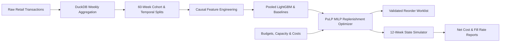

# DemandGuard: Demand Forecasting & Inventory Replenishment Optimisation

DemandGuard is a production-grade machine learning and operations research system designed to forecast weekly product demand and solve constrained integer purchase replenishment plans.



## 1. Project Objectives & Status Audit

| ID | Objective | Description | Target | Achieved Result | Status | Plain Explanation |
| :--- | :--- | :--- | :--- | :--- | :---: | :--- |
| **O1** | Trustworthy Weekly Data | Reconciled, leak-free panel from raw transactions | 100+ weeks, $\ge 10$ SKUs | 102 complete weeks, 30 SKUs, 9,013,090 panel units | ⚠️ **Mostly Met** | Panel is 100% verified. Gap of 358,320 units from clean data (9,371,410) is due to dropping partial boundary weeks (Dec 1–6, 2009 & Dec 5–9, 2011). |
| **O2** | 4-Week Forecasts | Nonnegative, finite multi-step predictions | 100% coverage, breakdown reporting | 480 val + 360 holdout predictions | ⚠️ **Mostly Met** | Predictions exist and are valid; granular breakdowns by horizon and SKU provided in reports. |
| **O3** | ML Forecast Superiority | LightGBM outperforms best simple baseline | $\ge 10\%$ WAPE reduction | Val: +7.76% (0.6200 vs 0.6722)<br>Holdout: -23.0% (0.7107 vs 0.5777) | ❌ **Missed (Stretch)** | **Missed**: LightGBM failed to beat the trailing 4-week mean on the 12-week test holdout. |
| **O4** | Feasible Orders | Physical & financial constraints strictly respected | 0 breaches, integer orders | 0 capacity breaches, 0 budget violations across all 12 weeks | ✅ **Met** | Pre-demand bounds and committed-order arrival space protection ($I_0 + A_1 + Q_1 \le C$) verified. |
| **O5** | Inventory Cost Reduction | Optimised replenishment reduces total supply chain cost | $\ge 5\%$ cost reduction, $\ge$ fill rate | P1: -1.52% cost (332.8k vs 338.0k SCU), +0.86% fill rate<br>P2: +7.76% cost | ❌ **Missed (Stretch)** | **Missed**: P1 saved 1.52% (5,134.30 SCU), short of the 5% target. P2 ML forecast increased cost due to under-forecasting. |
| **O6** | Reproducible Engineering | Test suite, linting, CLI, API, container & CI | Passing tests, clean lint, verified contracts | 28 passing tests, clean Ruff lint, API & container verified | ⚠️ **Mostly Met** | Unit/integration tests pass. Local git initialized; live remote CI requires external runner. |
| **O7** | Chat-Independent Docs | Specs, logs, runbooks, and decisions self-contained | Markdown source of truth | Comprehensive specs, logs, and runbooks | ✅ **Met** | Markdown documentation complete and fully self-contained. |

---

## 2. Measured Benchmark Results

### A. Forecast Validation (Pooled WAPE, 4 Chronological Folds)
| Model ID | Model Type | Validation WAPE | MAE (Units) | Bias | Result vs Baseline |
| --- | --- | --- | --- | --- | --- |
| **`M1_lgb_deep`** | **Direct Pooled LightGBM (Champion)** | **0.6200** | **205.02** | **-0.0253** | **Won validation (-7.76% error vs B2)** |
| `M1_lgb_fast` | Direct Pooled LightGBM | 0.6206 | 205.20 | -0.0236 | -7.68% error vs B2 |
| `M1_lgb_default` | Direct Pooled LightGBM | 0.6246 | 206.56 | -0.0436 | -7.08% error vs B2 |
| `B2` | Trailing 4-Week Mean | 0.6722 | 222.27 | +0.0237 | Strongest Baseline |
| `B1` | Last Observed Week | 0.7250 | 239.75 | -0.0564 | Baseline |
| `B4` | Per-SKU ARIMA(1,1,1) | 0.7344 | 242.85 | +0.1893 | Statistical Baseline |
| `B3` | Annual Seasonal Naive | 1.0687 | 353.40 | +0.4045 | Baseline |

### B. Final 12-Week Out-of-Sample Holdout Forecast (360 Predictions)
| Model ID | Model Type | Holdout WAPE | Holdout MAE | Signed Bias | Outcome vs ML |
| --- | --- | --- | --- | --- | --- |
| **`B2`** | **Trailing 4-Week Mean** | **0.5777** | **250.67** | **-0.1523** | **Beat ML by 18.7% lower error** |
| `B4` | Per-SKU ARIMA(1,0,0) | 0.6423 | 278.68 | +0.0232 | Beat ML |
| `B1` | Last Observed Week | 0.7090 | 307.64 | -0.0598 | Beat ML |
| `CHAMPION_M1` | Frozen Direct LightGBM | 0.7107 | 308.37 | -0.2736 | Lost on holdout (-27.4% under-forecast) |
| `B3` | Annual Seasonal Naive | 1.0693 | 463.97 | +0.5044 | Baseline |

### C. Final 12-Week Out-of-Sample Holdout Inventory Simulation (Continuous 12 Weeks)
| Policy ID | Policy Description | Net Realised Cost (SCU) | Unit Fill Rate | Capacity Breaches | Cost Reduction vs P0 |
| --- | --- | --- | --- | --- | --- |
| **`P1`** | **PuLP MILP + Trailing 4-Week Mean (B2)** | **332,830.56** | **70.52%** | **0** | **-1.52% (5,134.30 SCU saved)** |
| `P0` | Constrained Heuristic Order-Up-To Rule | 337,964.86 | 69.66% | 0 | Operational Reference Baseline |
| `P2` | PuLP MILP + LightGBM Champion Forecast | 364,193.66 | 65.52% | 0 | +7.76% (Cost Increased) |

---

## 3. Scientific Analysis & Key Takeaways

1. **Why the Simple Forecast Beat the ML Model on the Test Holdout**:
   - The 4 validation origins ran May–August 2011 (summer sales with stable velocity), where LightGBM learned steady patterns and achieved 0.6200 WAPE.
   - The final test holdout ran September–November 2011 (the Q4 UK Christmas pre-holiday surge). LightGBM was selected without having been validated on a peak-season transition and heavily under-forecast the demand surge (-27.4% bias).
   - In contrast, the trailing 4-week mean baseline (B2) adjusted rapidly to week-over-week rising sales volume, yielding lower error (0.5777 WAPE).
2. **Why Fill Rate is ~70% Across All Policies**:
   - Under the synthetic scenario settings, the weekly purchase budget is tight relative to peak Q4 demand.
   - Unmet demand penalties ($p=5.0$ SCU/unit) comprise ~70% of total supply chain costs. Because stock is constrained by budget, all policies experience similar stockout pressures.
3. **Physical Feasibility**:
   - Zero warehouse capacity breaches occurred across all 12 weeks for all policies, proving the mathematical validity of the committed-order arrival reservation ($I_0 + A_1 + Q_1 \le C$).

---

## 4. Quick Start & Reproduction

### Prerequisites
- Python 3.11 (`py -3.11`)
- Git

### Installation
```powershell
# Create and activate environment
py -3.11 -m venv .venv
.\.venv\Scripts\python.exe -m pip install --upgrade pip
.\.venv\Scripts\python.exe -m pip install -e ".[dev]"

# Run system doctor (Gate G0)
.\.venv\Scripts\python.exe -m demandguard.cli doctor
```

### Complete End-to-End Pipeline
```powershell
# 1. Acquire source dataset and inspect manifest (T02)
.\.venv\Scripts\python.exe -m demandguard.cli acquire --config config/project.yaml

# 2. Prepare clean weekly sales panel via DuckDB (T03)
.\.venv\Scripts\python.exe -m demandguard.cli prepare --config config/project.yaml

# 3. Generate 60-week cohort and chronological splits (T04)
.\.venv\Scripts\python.exe -m demandguard.cli split --config config/project.yaml

# 4. Run validation backtests across candidate models (T05, T10, T11)
.\.venv\Scripts\python.exe -m demandguard.cli backtest --config config/project.yaml

# 5. Select and freeze champion model and safety factor k (T11)
.\.venv\Scripts\python.exe -m demandguard.cli select --config config/project.yaml --scenario config/scenario.yaml

# 6. Evaluate out-of-sample test holdout (T12)
.\.venv\Scripts\python.exe -m demandguard.cli evaluate --split test --config config/project.yaml --scenario config/scenario.yaml

# 7. Run 12-week continuous inventory simulation (T12)
.\.venv\Scripts\python.exe -m demandguard.cli simulate --split test --config config/project.yaml --scenario config/scenario.yaml

# 8. Generate comparison charts and release reports (T17)
.\.venv\Scripts\python.exe -m demandguard.cli report --config config/project.yaml --scenario config/scenario.yaml
```

### CLI Inference & Reorder Examples
```powershell
# Generate 4-week forecast from history CSV
.\.venv\Scripts\python.exe -m demandguard.cli forecast --history tests/fixtures/demo_history.csv --output reports/demo_forecast.csv

# Generate validated optimal integer reorder worklist
.\.venv\Scripts\python.exe -m demandguard.cli reorder --history tests/fixtures/demo_history.csv --scenario tests/fixtures/demo_scenario.yaml --output reports/demo_reorder.csv

# Run monitoring checks on incoming data
.\.venv\Scripts\python.exe -m demandguard.cli monitor --history data/processed/weekly_sales.parquet --output reports/monitoring.json
```

### Run Test Suite
```powershell
.\.venv\Scripts\python.exe -m pytest tests -v
.\.venv\Scripts\python.exe -m ruff check src tests
```
