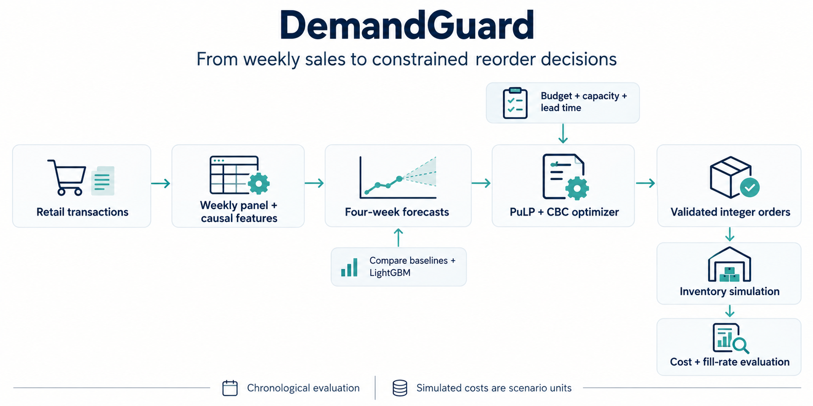

# DemandGuard

**Forecast weekly product sales and test reorder decisions under budget and storage limits.**

[](https://github.com/luqshzeeq3601-art/03_DemandGuard_Demand_Forecasting_Inventory_Optimisation/actions/workflows/ci.yml)
[](LICENSE)

DemandGuard compares simple forecasts with pooled LightGBM, predicts four weeks ahead and uses PuLP/CBC to recommend whole-unit orders. It evaluates 30 established products from the UK UCI Online Retail II benchmark. The API, CLI and inventory simulation make forecasting and purchasing constraints inspectable.

## 1. Workflow



Forecast quality and inventory-policy quality are measured separately. The optimizer checks feasibility and solver status before returning orders. Costs and inventory conditions are scenario inputs, not measured business finances.

## 2. Measured results

These figures use the current saved files identified in [the evidence manifest](reports/evidence_manifest.json). Historical v0.2/stress results are separate experiments.

| Forecast comparison | ML artifact | B2 baseline |
| --- | --- | --- |
| Validation WAPE | **0.6320** | 0.6722 |
| Previously viewed holdout WAPE | **0.6506** | **0.5777** |

Lower WAPE is better. The validation reduction is 5.97%, below the 10% target. On the viewed holdout, the ML artifact is worse than B2.

| Inventory policy | Total simulated cost (SCU) | Fill rate | Unproven solves |
| --- | --- | --- | --- |
| P0 rule | **337,964.86** | **69.66%** | 0 |
| P1 MILP + baseline | 340,215.08 | 68.05% | 2 |
| P2 MILP + ML | 355,391.66 | 66.79% | 0 |

The 5% lower-cost/non-worse-fill target was missed. [Forecast report](reports/forecast_comparison.md) · [Inventory report](reports/inventory_simulation_report.md) · [Model card](docs/MODEL_CARD.md).

## 3. Quick start

### Run the packaged API

```sh
docker build -t demandguard:local .
docker run --rm -p 127.0.0.1:8000:8000 demandguard:local
```

Open [local API docs](http://127.0.0.1:8000/docs). With the service running, use another terminal for the synthetic forecast/reorder check:

```sh
python scripts/smoke_api.py
```

The default image serves the saved v0.1 champion. The separately named v0.2 bundle is exploratory and must not be mixed into the current headline results.

### Use Python locally

Use Python 3.11. Clone/download the same branch or revision as this README, then run from the repository root. The verified updates are currently in [draft PR 1](https://github.com/luqshzeeq3601-art/03_DemandGuard_Demand_Forecasting_Inventory_Optimisation/pull/1) on `fix/portfolio-remediation`.

```sh
python -m venv .venv
```

Activate with `.\.venv\Scripts\Activate.ps1` in Windows PowerShell, or `source .venv/bin/activate` on Linux/macOS.

```sh
python -m pip install -r requirements.lock.txt
python -m pip install --no-deps -e .
```

```sh
python -m demandguard.cli doctor
python -m uvicorn demandguard.api:app --host 127.0.0.1 --port 8000
```

The doctor checks environment/solver availability. CBC is included in the Docker image; local setup must provide the solver reported by the doctor. See [operations and commands](docs/08_OPERATIONS_AND_COMMANDS.md) for acquisition, training, CLI forecast/reorder and monitoring; [synthetic demo history](tests/fixtures/demo_history.csv) and [scenario](tests/fixtures/demo_scenario.yaml) are public inputs.

## 4. API and verification

| Endpoint | Purpose |
| --- | --- |
| `GET /health` | Service liveness |
| `GET /ready` | Trusted forecasting artifact present |
| `POST /forecast` | Four-week product forecasts |
| `POST /reorder` | Constrained integer purchasing plan |

```sh
python -m pytest tests -p no:cacheprovider --basetemp .pytest_tmp
python -m ruff check src tests
python -m ruff format --check src tests
```

CI includes tests, an image build, readiness, synthetic forecast and constrained reorder checks. A reporting regression verifies that narratives follow saved metrics instead of retaining old hard-coded scores.

## 5. Limitations and delivery

- **No untouched test period remains.** Reproducing or exploring the previously viewed holdout does not establish a new generalization result.
- D21 records a v0.1 refit-selection defect: the legacy `M1_lgb_deep` label represents the saved 31-leaf/80-tree artifact. The label is retained for provenance; this documentation change does not repair or retune that model.
- Recorded sales stand in for demand; stock-availability records are absent. Costs, budgets and penalties are synthetic scenario units.
- The catalogue is fixed to 30 established UK products. Malaysian retailer performance and cold-start products are unverified.
- **Public hosted forecast/reorder delivery remains unverified.** The existing Render/Cloud Run configuration is preparation, not a working-service claim.

## 6. Documentation and contributions

[Start here](docs/00_START_HERE.md) · [Technical design](docs/04_TECHNICAL_DESIGN.md) · [Inventory rules](docs/06_INVENTORY_OPTIMISATION.md) · [Tasks](tasks/todo.md) · [Progress](docs/10_PROGRESS_LOG.md) · [Sources](docs/11_SOURCES.md) · [Diagram notes and prompt](docs/assets/workflow.md)

Follow [AGENTS.md](AGENTS.md). Keep model/policy research separate, freeze validation choices before a legitimate new test, and report failed targets honestly.

## 7. License and data

Code/documentation use the [MIT license](LICENSE). UCI Online Retail II has separate source attribution and terms; raw transactions are acquired separately. See [data rules](docs/03_DATA_SPEC.md) and [source provenance](data/raw/source_manifest.json).

