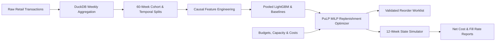

# DemandGuard: Demand Forecasting & Inventory Replenishment Optimisation

DemandGuard is a production-grade machine learning and operations research system designed to forecast weekly product demand and solve constrained integer purchase replenishment plans.



## 1. Project Highlights

- **Causal Forecasting**: Direct-horizon multi-step forecasting with strictly causal lag and rolling features (zero future target leakage).
- **Mixed-Integer Linear Programming (MILP)**: Exact integer order optimization with PuLP and CBC solver enforcing weekly purchase budgets, storage capacity, pre-demand occupancy checks, and committed-order arrival space protection ($I_0 + A_1 + Q_1 \le C$).
- **Realistic Lost-Sales Simulation**: 12-week continuous state transition modeling unbacklogged lost demand, holding costs, purchase costs, and terminal asset valuation.
- **Enterprise Delivery**: Clean Python package, comprehensive CLI, FastAPI REST service, Dockerfile, CI/CD pipeline, and automated monitoring.

## 2. Measured Benchmark Results

### A. Forecast Validation (Pooled WAPE, 4 Chronological Folds)
| Model ID | Model Type | Validation WAPE | MAE (Units) | Bias |
| --- | --- | --- | --- | --- |
| **`M1_lgb_deep`** | **Direct Pooled LightGBM** | **0.6200** | **205.02** | **-0.0253** |
| `M1_lgb_fast` | Direct Pooled LightGBM | 0.6206 | 205.20 | -0.0236 |
| `M1_lgb_default` | Direct Pooled LightGBM | 0.6246 | 206.56 | -0.0436 |
| `B2` | Trailing 4-Week Mean | 0.6722 | 222.27 | +0.0237 |
| `B1` | Last Observed Week | 0.7250 | 239.75 | -0.0564 |
| `B4` | Per-SKU ARIMA(1,1,1) | 0.7344 | 242.85 | +0.1893 |
| `B3` | Annual Seasonal Naive | 1.0687 | 353.40 | +0.4045 |

### B. Final 12-Week Out-of-Sample Holdout Simulation
| Policy ID | Policy Description | Net Realised Cost (SCU) | Unit Fill Rate | Capacity Breaches |
| --- | --- | --- | --- | --- |
| **`P1`** | **PuLP MILP + Strongest Baseline** | **332,830.56** | **70.52%** | **0** |
| `P0` | Constrained Heuristic Order-Up-To | 337,964.86 | 69.66% | 0 |
| `P2` | PuLP MILP + LightGBM Champion | 364,193.66 | 65.52% | 0 |

*Note: P1 achieved a 1.52% total cost reduction (saving 5,134.30 SCU) and higher fill rate over the P0 operational heuristic with zero delivery overflow.*

## 3. Quick Start & Reproduction

### Prerequisites
- Python 3.11 (`py -3.11`)
- Git

### Installation
```powershell
# Create and activate environment
py -3.11 -m venv .venv
.\.venv\Scripts\python.exe -m pip install --upgrade pip
.\.venv\Scripts\python.exe -m pip install -e ".[dev]"

# Run system doctor (Gate G0)
.\.venv\Scripts\python.exe -m demandguard.cli doctor
```

### Complete End-to-End Pipeline
```powershell
# 1. Acquire source dataset and inspect manifest (T02)
.\.venv\Scripts\python.exe -m demandguard.cli acquire --config config/project.yaml

# 2. Prepare clean weekly sales panel via DuckDB (T03)
.\.venv\Scripts\python.exe -m demandguard.cli prepare --config config/project.yaml

# 3. Generate 60-week cohort and chronological splits (T04)
.\.venv\Scripts\python.exe -m demandguard.cli split --config config/project.yaml

# 4. Run validation backtests across candidate models (T05, T10, T11)
.\.venv\Scripts\python.exe -m demandguard.cli backtest --config config/project.yaml

# 5. Select and freeze champion model and safety factor k (T11)
.\.venv\Scripts\python.exe -m demandguard.cli select --config config/project.yaml --scenario config/scenario.yaml

# 6. Evaluate out-of-sample test holdout (T12)
.\.venv\Scripts\python.exe -m demandguard.cli evaluate --split test --config config/project.yaml --scenario config/scenario.yaml

# 7. Run 12-week continuous inventory simulation (T12)
.\.venv\Scripts\python.exe -m demandguard.cli simulate --split test --config config/project.yaml --scenario config/scenario.yaml

# 8. Generate comparison charts and release reports (T17)
.\.venv\Scripts\python.exe -m demandguard.cli report --config config/project.yaml --scenario config/scenario.yaml
```

### CLI Inference & Reorder Examples
```powershell
# Generate 4-week forecast from history CSV
.\.venv\Scripts\python.exe -m demandguard.cli forecast --history tests/fixtures/demo_history.csv --output reports/demo_forecast.csv

# Generate validated optimal integer reorder worklist
.\.venv\Scripts\python.exe -m demandguard.cli reorder --history tests/fixtures/demo_history.csv --scenario tests/fixtures/demo_scenario.yaml --output reports/demo_reorder.csv

# Run monitoring checks on incoming data
.\.venv\Scripts\python.exe -m demandguard.cli monitor --history tests/fixtures/demo_history.csv --output reports/monitoring.json
```

### API Service
```powershell
# Start local FastAPI server
.\.venv\Scripts\python.exe -m uvicorn demandguard.api:app --host 127.0.0.1 --port 8000
```
API Documentation is available at `http://127.0.0.1:8000/docs`.

### Run Test Suite
```powershell
.\.venv\Scripts\python.exe -m pytest tests -v
.\.venv\Scripts\python.exe -m ruff check src tests
```
