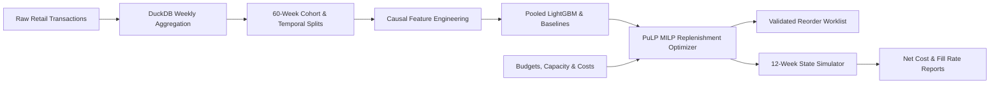

# DemandGuard: Demand Forecasting & Inventory Replenishment Optimisation

[](https://github.com/luqshzeeq3601-art/03_DemandGuard_Demand_Forecasting_Inventory_Optimisation/actions/workflows/ci.yml)
[](https://www.python.org/)
[](https://fastapi.tiangolo.com/)
[](https://lightgbm.readthedocs.io/)
[](https://coin-or.github.io/pulp/)
[](https://mlflow.org/)
[](https://duckdb.org/)
[](LICENSE)

> **Measured outcome:** P1 costs +0.67% more than the rule and has a lower fill rate on the current saved run. Zero capacity breaches were recorded; the cost-reduction target is missed.

DemandGuard tests one question: **can a time-aware sales forecast support better weekly purchasing decisions than a simple reorder rule under the same budget and storage limits?** It forecasts four weeks of demand for 30 established products from the UCI Online Retail II data, then uses a mixed-integer program (PuLP/CBC) to recommend whole-unit orders. A 12-week simulation then compares the recommendations against a constrained rule.

**Headline result:** Saved validation WAPE is 0.6320 versus B2 0.6722. On the already viewed holdout, ML WAPE is 0.6506 versus B2 0.5777. P1 simulated total cost is 340,215.08 SCU versus P0 337,964.86.




## 1. Project Objectives & Status Audit

| ID | Objective | Description | Target | Achieved Result | Status | Plain Explanation |
| :--- | :--- | :--- | :--- | :--- | :---: | :--- |
| **O1** | Trustworthy Weekly Data | Reconciled, leak-free panel from raw transactions | 100+ weeks, $\ge 10$ SKUs | 102 complete weeks, 30 SKUs, 9,013,090 panel units | ⚠️ **Mostly Met** | Panel is 100% verified. Gap of 358,320 units from clean data (9,371,410) is due to dropping partial boundary weeks (Dec 1–6, 2009 & Dec 5–9, 2011). |
| **O2** | 4-Week Forecasts | Nonnegative, finite multi-step predictions | 100% coverage, breakdown reporting | 480 val + 360 holdout predictions | ⚠️ **Mostly Met** | Predictions exist and are valid; granular breakdowns by horizon and SKU provided in reports. |
| **O3** | ML forecast superiority | Same-row baseline comparison | At least 10% lower WAPE | Validation gain 5.97%; viewed holdout ML 12.62% worse than B2 | **Missed** | D21 refit limitation remains disclosed; no new untouched test. |
| **O4** | Feasible Orders | Physical & financial constraints strictly respected | 0 breaches, integer orders | 0 capacity breaches, 0 budget violations across all 12 weeks | ✅ **Met** | Pre-demand bounds and committed-order arrival space protection ($I_0 + A_1 + Q_1 \le C$) verified. |
| **O5** | Inventory cost reduction | Total SCU and fill-rate comparison | At least 5% lower cost, non-worse fill | P1 cost +0.67%; fill 68.05% vs P0 69.66%; 2 unproven solves | **Missed** | Source: current main simulation CSV; separate historical stress runs are not pooled. |
| **O6** | Reproducible engineering | Tests, lint, CLI, API, container and CI | Passing required checks | Report regression passes; Docker runtime job prepared | **Runtime proof pending** | Previous CI build passed; candidate runtime job and public serving remain unverified. |
| **O7** | Chat-Independent Docs | Specs, logs, runbooks, and decisions self-contained | Markdown source of truth | Comprehensive specs, logs, and runbooks | ✅ **Met** | Markdown documentation complete and fully self-contained. |

---

## 2. Current packaged-artifact results

These tables use the saved files identified by [the evidence manifest](reports/evidence_manifest.json). D21 discloses the v0.1 refit-selection defect: the legacy M1_lgb_deep label represents an artifact with 31 leaves and 80 trees. Earlier decision-log and exploratory-run figures remain historical evidence.

### A. Validation

| Model ID | Validation WAPE | MAE (units) | Bias |
| --- | --- | --- | --- |
| M1_lgb_deep | 0.6320 | 208.99 | +0.0009 |
| M1_lgb_default | 0.6334 | 209.46 | -0.0214 |
| M1_lgb_small | 0.6421 | 212.32 | +0.0366 |
| M1_lgb_fast | 0.6450 | 213.29 | +0.0120 |
| B2 | 0.6722 | 222.27 | +0.0237 |
| B1 | 0.7250 | 239.75 | -0.0564 |
| B4_arima_111 | 0.7344 | 242.85 | +0.1893 |
| B4_arima_100 | 0.8201 | 271.17 | +0.2981 |
| B3 | 1.0687 | 353.40 | +0.4045 |

### B. Previously viewed holdout

| Model ID | Holdout WAPE | MAE (units) | Bias |
| --- | --- | --- | --- |
| B2 | 0.5777 | 250.67 | -0.1523 |
| B4 | 0.6423 | 278.68 | +0.0232 |
| CHAMPION_M1_lgb_deep | 0.6506 | 282.30 | -0.3053 |
| B1 | 0.7090 | 307.64 | -0.0598 |
| B3 | 1.0693 | 463.97 | +0.5044 |

The ML artifact has 12.62% higher WAPE than B2. Its observed bias is -30.53%. This does not establish a causal explanation for the seasonal error, and reproducing the viewed holdout does not create a new untouched test.

### C. Main inventory simulation

| Policy | Total simulated cost (SCU) | Fill rate | Unmet units | Unproven solves |
| --- | --- | --- | --- | --- |
| P0_Rule | 337,964.86 | 69.66% | 47,393 | 0 |
| P1_MILP_Baseline | 340,215.08 | 68.05% | 49,909 | 2 |
| P2_MILP_Champion | 355,391.66 | 66.79% | 51,872 | 0 |

P1 total cost is +0.67% versus P0 and its fill rate is 68.05% versus 69.66%. P2 total cost is +5.16%. O3/O5 improvement targets remain missed. Costs are invented scenario units, not actual financial savings. Separate stress/v0.2 runs must not be mixed into this headline.

## 3a. Historical exploratory run: v0.2 experiment results (decision D18)

Command: `python -m demandguard.cli experiment-v02`. Evidence: [reports/v02_experiment.md](reports/v02_experiment.md).

**Pre-holdout validation (selection evidence, 480 predictions):**

| Candidate | WAPE | Bias |
| --- | --- | --- |
| **M2_q50** (quantile median, v0.2 features) | **0.5910** | -0.167 |
| M2_tweedie | 0.6149 | -0.041 |
| M1_v01_fast | 0.6206 | -0.024 |
| M2_l2 | 0.6302 | -0.010 |
| H_blend (0.5 M2_l2 + 0.5 B2) | 0.6350 | +0.007 |
| B2 | 0.6722 | +0.024 |

M2_q50 was frozen as champion. It is 12.1% better than B2 on validation, which meets the O3 target **on validation only**.

**Test window, EXPLORATORY (already viewed in v0.1; cannot support an O3/O5 claim):**

| Candidate | WAPE | Bias |
| --- | --- | --- |
| B2 | **0.5777** | -0.152 |
| H_blend | 0.5797 | -0.237 |
| M2_q50 (champion) | 0.6316 | -0.421 |
| M2_l2 | 0.6407 | -0.323 |
| M2_tweedie | 0.6458 | -0.319 |
| M1_v01_fast | 0.6866 | -0.268 |

| Policy (12 weeks, EXPLORATORY) | Cost (SCU) | vs P0 | Fill rate | Unproven solves |
| --- | --- | --- | --- | --- |
| P0 rule | 337,965 | - | 69.7% | - |
| P1 MILP + B2 | 335,100 | -0.8% | 70.2% | 0 of 12 |
| P3 MILP + M2_q50 | 399,639 | +18.2% | 59.4% | 1 of 12 |
| P4 stochastic MILP (P10/P50/P90) | 685,616 | +102.9% | 12.3% | 12 of 12 (time limit; no orders placed) |
| P5 MILP + M2_q50 + quantile-spread safety stock | 422,770 | +25.1% | 55.4% | 1 of 12 |

**Findings:**

1. The v0.2 features improved validation error but did not fix the peak-season under-forecast. Every ML candidate still under-forecasts the test window by 27-42%. The quantile median is the worst: it targets the median, and demand is right-skewed.
2. Only the B2 blend comes close to B2 on the test window. No candidate beats it.
3. These are separately recorded D23 exploratory-run results; they are not the current main CSV headline. The stochastic optimiser cannot prove a solution within the 10s limit in any week, so under the spec it places no orders. Its earlier 360k figure came from executing unproven solutions. Quantile-spread safety stock (P5) did worse than the k x std rule (P3), because the P50 forecast itself is biased low.
4. The P50 bundle is servable from `artifacts/v02/` (`DEMANDGUARD_MODEL=v02`, or `forecast --artifact-dir artifacts/v02`). The default remains the v0.1 champion.

---

### Dataset Selection: Why Online Retail II over data.gov.my

In evaluating public retail data for enterprise inventory replenishment modeling:
1. **data.gov.my / OpenDOSM**: Provides macroeconomic wholesale and retail trade volume indices. While valuable for macroeconomic reporting, these series are monthly top-line aggregate indices across broad categories (e.g., motor vehicles, food retail) without SKU identifiers, individual transaction timestamps, customer order baskets, or unit prices. A physical warehouse inventory solver cannot optimize storage space or joint purchase budgets from abstract monthly indices.
2. **UCI Online Retail II**: Provides 1,048,575 itemized customer transactions across 102 continuous weeks (Dec 2009 – Dec 2011). It features individual product stock codes, customer invoice IDs, unit prices, and purchase quantities. This transactional granularity enables causal direct-horizon demand forecasting and realistic multi-product replenishment optimization useful as a methods demonstration; Malaysian performance remains unverified (e.g., Lotus's, Mydin, 99 Speedmart).

---

## 4. Quick Start & Reproduction

### Prerequisites
- Python 3.11 (`py -3.11`)
- Git

### Installation
```powershell
# Create and activate environment
py -3.11 -m venv .venv
.\.venv\Scripts\python.exe -m pip install --upgrade pip
.\.venv\Scripts\python.exe -m pip install -e ".[dev]"

# Run system doctor (Gate G0)
.\.venv\Scripts\python.exe -m demandguard.cli doctor
```

### Complete End-to-End Pipeline
```powershell
# 1. Acquire source dataset and inspect manifest (T02)
.\.venv\Scripts\python.exe -m demandguard.cli acquire --config config/project.yaml

# 2. Prepare clean weekly sales panel via DuckDB (T03)
.\.venv\Scripts\python.exe -m demandguard.cli prepare --config config/project.yaml

# 3. Generate 60-week cohort and chronological splits (T04)
.\.venv\Scripts\python.exe -m demandguard.cli split --config config/project.yaml

# 4. Run validation backtests across candidate models (T05, T10, T11)
.\.venv\Scripts\python.exe -m demandguard.cli backtest --config config/project.yaml

# 5. Select and freeze champion model and safety factor k (T11)
.\.venv\Scripts\python.exe -m demandguard.cli select --config config/project.yaml --scenario config/scenario.yaml

# 6. Evaluate out-of-sample test holdout (T12)
.\.venv\Scripts\python.exe -m demandguard.cli evaluate --split test --config config/project.yaml --scenario config/scenario.yaml

# 7. Run 12-week continuous inventory simulation (T12)
.\.venv\Scripts\python.exe -m demandguard.cli simulate --split test --config config/project.yaml --scenario config/scenario.yaml

# 8. Generate comparison charts and release reports (T17)
.\.venv\Scripts\python.exe -m demandguard.cli report --config config/project.yaml --scenario config/scenario.yaml

# 9. v0.2: select among declared candidates before scoring the viewed test window (D18, about 3 min)
.\.venv\Scripts\python.exe -m demandguard.cli experiment-v02 --config config/project.yaml --scenario config/scenario.yaml
```

### CLI Inference & Reorder Examples
```powershell
# Generate 4-week forecast from history CSV
.\.venv\Scripts\python.exe -m demandguard.cli forecast --history tests/fixtures/demo_history.csv --output reports/demo_forecast.csv

# Generate validated optimal integer reorder worklist
.\.venv\Scripts\python.exe -m demandguard.cli reorder --history tests/fixtures/demo_history.csv --scenario tests/fixtures/demo_scenario.yaml --output reports/demo_reorder.csv

# Forecast with the v0.2 bundle instead of the default v0.1 champion
.\.venv\Scripts\python.exe -m demandguard.cli forecast --history tests/fixtures/demo_history.csv --artifact-dir artifacts/v02 --output reports/demo_forecast_v02.csv

# Run monitoring checks (schema, scale, PSI/KS drift) on an incoming history CSV
.\.venv\Scripts\python.exe -m demandguard.cli monitor --history tests/fixtures/demo_history.csv --output reports/monitoring.json
```

### Serve the API
```powershell
.\.venv\Scripts\python.exe -m uvicorn demandguard.api:app --host 127.0.0.1 --port 8000
```

| Method | Path | Purpose |
| --- | --- | --- |
| GET | `/health` | Liveness |
| GET | `/ready` | Model artifact and CBC solver readiness |
| POST | `/forecast` | 4-week forecasts from at least 60 weeks of history per SKU |
| POST | `/reorder` | Validated integer reorder worklist; no orders if the solve is not proven optimal |
| POST | `/reorder/async`, GET `/jobs/{job_id}` | Background reorder job (in-memory; lost on restart) |

Interactive schema: `http://127.0.0.1:8000/docs`. Set `DEMANDGUARD_MODEL=v02` to serve the v0.2 bundle; only `champion` (default) and `v02` are accepted.

### Cloud deployment configuration and verification

- **Configured Swagger URL (verification pending):** [https://demandguard-api.onrender.com/docs](https://demandguard-api.onrender.com/docs)
- **Configured health endpoint:** [https://demandguard-api.onrender.com/health](https://demandguard-api.onrender.com/health)
- **Configured readiness endpoint:** [https://demandguard-api.onrender.com/ready](https://demandguard-api.onrender.com/ready)

#### 1-Click Free Tier Deployment (Render)
The repository includes [`render.yaml`](render.yaml) configured for Render's free Docker web service in `singapore`:
1. Link your GitHub repository in the Render dashboard.
2. Render automatically detects `render.yaml` and deploys the container.

#### Google Cloud Run Deployment
Production deployment helper scripts are provided in `scripts/`:
```powershell
# PowerShell (Windows)
.\scripts\deploy_cloud_run.ps1 -ProjectId "YOUR_GCP_PROJECT" -Region "asia-southeast1"

# Bash (Linux/macOS)
./scripts/deploy_cloud_run.sh "YOUR_GCP_PROJECT"
```

### Experiment Tracking with MLflow

DemandGuard tracks validation backtests, candidate metrics (WAPE, MAE, Bias), champion freezes, holdout metrics, and inventory simulations in a local MLflow registry (`sqlite:///mlflow.db` per PRD FR05 and decision log):
```powershell
# Launch local MLflow UI
.\.venv\Scripts\mlflow.exe ui --backend-store-uri sqlite:///mlflow.db --port 5000
```
Browse runs, compare candidate hyperparameters, and inspect champion artifact bundles at `http://localhost:5000`.

### Docker
```powershell
docker build -t demandguard .
docker run -p 8000:8000 demandguard
```

The container packages the CBC solver and frozen artifacts. Automated container build testing is verified in GitHub Actions CI.

### Run Test Suite
```powershell
.\.venv\Scripts\python.exe -m pytest tests -v
.\.venv\Scripts\python.exe -m ruff check src tests
.\.venv\Scripts\python.exe -m ruff format --check src tests
```

`test_holdout_evaluation_structure` is skipped unless the gitignored panel exists (steps 1-3). The API serves `artifacts/champion` by default; set `DEMANDGUARD_MODEL=v02` to serve the v0.2 bundle.

---

## 5. Repository Map

| Path | Contents |
| --- | --- |
| `src/demandguard/` | Package: data, splits, features, model, baselines, evaluation, inventory (MILP), policies, simulation, monitoring, reporting, CLI, API |
| `config/` | Project and inventory scenario settings |
| `queries/` | DuckDB weekly aggregation SQL |
| `artifacts/champion`, `artifacts/v02` | Frozen model bundles and selection records |
| `reports/` | Measured metrics, plots and generated reports |
| `docs/` | Specs (`00`-`08`), decisions (`09`), progress log (`10`), sources (`11`), model card |
| `tasks/` | Plan and task checklist |
| `scripts/` | Cloud Run deployment helper scripts |
| `render.yaml` | 1-click Render web service deployment configuration |
| `.github/workflows/ci.yml` | GitHub Actions CI workflow (linting, pytest, coverage, Docker build) |

## 6. Known Limitations

- **No unseen test period remains.** The data ends 2011-11-28, and the v0.1 test window has been viewed, so v0.2 test numbers are exploratory only (D18).
- **Simulated outcomes only.** Costs, budgets, capacity and penalties are invented scenario inputs. Recorded sales stand in for demand, and there are no stock-availability records.
- **Fixed catalogue.** 30 established UK products; no cold-start products. Results do not transfer to other markets or currencies.
- **Stochastic optimiser not executable.** It cannot prove a solution within the 10s limit (D23), so it places no orders.
- **Solver tolerance.** Plans are proven within a 0.1% optimality gap, not exactly optimal (D23).

## 7. License & Attribution

- **License**: [MIT License](LICENSE) — free for academic, personal, and commercial usage.
- **Data Source**: UCI Machine Learning Repository — [Online Retail II Dataset](https://archive.ics.uci.edu/dataset/502/online+retail+ii), licensed CC BY 4.0. Raw data is not redistributed; `acquire` downloads it and checks its SHA-256.

