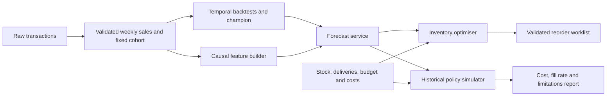

# 04. Technical design

## 1. Design approach

One Python package owns the workflow. Keep data preparation, forecasting, optimisation and simulation separately testable. The CLI and API call the same services; neither reimplements model or inventory logic.



Build order: data contract -> baseline forecast -> shared simulation -> optimiser -> model comparison -> serving -> release evidence. The first useful slice is a baseline forecast and a constrained reorder rule that can be evaluated end to end.

## 2. Planned structure

Only the Markdown handoff currently exists. Create implementation directories as their tasks need them.

```text
README.md
AGENTS.md
docs/                         # Specifications and project records
tasks/plan.md
tasks/todo.md
pyproject.toml                # Runtime/dev dependencies and tool configuration
requirements.lock.txt         # Resolved local environment
config/project.yaml           # Data, forecast and performance settings
config/scenario.yaml          # Explicit synthetic inventory parameters
src/demandguard/
  __init__.py
  cli.py                      # Command adapters
  contracts.py                # Shared request/output schemas
  data.py                     # Acquisition, validation and preparation
  splits.py                   # Cohort and temporal manifests
  features.py                 # Causal direct-horizon features
  baselines.py                # Naive rules and ARIMA
  model.py                    # LightGBM fitting and artifact loading
  evaluation.py               # Temporal metrics and comparison
  inventory.py                # PuLP model and post-solve validation
  policies.py                 # Rule and forecast-driven policies
  simulation.py               # Shared weekly state transitions
  api.py                      # FastAPI adapters
  monitoring.py               # Data/forecast quality and delayed metrics
  reporting.py                # Plots, tables and report assembly
tests/fixtures/               # Small synthetic inputs with known answers
tests/                        # Focused unit and integration checks
data/raw/                     # Immutable source and provenance
data/processed/               # Weekly panel, cohort and split manifests
artifacts/champion/           # Trusted, versioned model bundle
reports/                      # Metrics, predictions, simulation and plots
Dockerfile
.github/workflows/ci.yml
```

## 3. Dependency choices

| Dependency | Responsibility |
| --- | --- |
| Python 3.12 | Common runtime target; verify availability before bootstrap |
| pandas + openpyxl reader | Read the source workbook, transform tabular records |
| DuckDB + PyArrow | SQL aggregation and Parquet interchange |
| NumPy + scikit-learn | Numerical operations and compatible utilities |
| LightGBM | CPU pooled direct-horizon regressor |
| statsmodels | ARIMA baseline |
| PuLP + CBC | Integer purchase decisions |
| MLflow | Local experiment tracking |
| FastAPI + Pydantic + Uvicorn | Typed local API |
| PyYAML | Validated configuration loading |
| pytest + httpx + Ruff | Tests, API checks and linting |
| Matplotlib | Inspectable static figures |

T01 must resolve supported stable releases, lock exact versions and smoke-test the solver in Windows. Verify the solver again inside Docker. Current PuLP documentation describes changed APIs and separate solver provisioning; do not copy older solver snippets without checking the installed release. See 11_SOURCES.md.

## 4. Forecast contract

Input contains `as_of_week_start` (Monday of the most recent closed week), `horizon_weeks=4`, and a weekly history for each requested supported sku_id.

- Require at least 60 consecutive complete weeks per product ending at the same as-of week.
- History keys are unique and cover every week; all units are nonnegative integers.
- Reject future rows relative to the declared origin. Server cannot determine real historical availability beyond the supplied contract.
- Serving origins must be at or after the artifact's training cutoff. Historical backtests use their own cutoff-specific bundles rather than a future-trained serving model.
- For an ARIMA champion, history must also cover every observed week after the saved training cutoff so filtering state can advance without refitting coefficients. Reject a missing update bridge.
- Require 1-30 unique products from the frozen cohort; subset requests are allowed.
- Preserve trained SKU category mapping. Do not infer a new category vocabulary from requests.

Output rows: `sku_id`, `origin_week_start`, `target_week_start`, `horizon`, `predicted_units`, `model_version`, `data_version`, `run_id`.

Predictions are finite nonnegative real numbers. Clipping below zero is an explicit shared postprocessing rule, recorded in experiments. Point predictions carry no claimed service-level guarantee or calibrated interval.

## 5. Reorder contract

Input contains:

- A trusted forecast result or the history needed to create it using the selected artifact.
- One inventory row per requested product: nonnegative integer `on_hand_units`, integer `incoming_week_1_units`, positive `unit_purchase_cost_scu`, `holding_cost_scu_per_unit_week`, `unmet_penalty_scu_per_unit`, and positive `storage_slots_per_unit`.
- Four nonnegative finite `weekly_budget_scu` values, positive integer `warehouse_capacity_slots`, fixed `lead_time_weeks=1`, nonnegative per-product safety stock, and `terminal_value_fraction=0.5`.
- Currency label `SCU` means synthetic cost units. Never print RM savings for this scenario.

Response identifies solver/version/status, objective breakdown, independent validation results, runtime, warnings and configuration hash. Worklist rows contain product, four forecasts, current stock, incoming stock, **current order Q1**, expected arrival in week 2, current spend, and provisional Q2/Q3. Q4 is zero under the finite-horizon rule.

Inventory mathematical definitions and timing belong to 06_INVENTORY_OPTIMISATION.md. Do not round a continuous solution into a supposedly feasible integer plan.

## 6. API contract

| Endpoint | Purpose | Response rules |
| --- | --- | --- |
| `GET /health` | Process liveness | 200 if server can answer; no model-ready implication |
| `GET /ready` | Artifact and solver readiness | 200 if both verified, otherwise 503 with named prerequisite |
| `POST /forecast` | Forecast one batch | 200 validated predictions; 422 invalid input; 503 artifact unavailable |
| `POST /reorder` | Forecast and solve one scenario | 200 optimal validated worklist; 422 invalid input; 409 infeasible scenario; 503 missing prerequisite or solver timeout/failure |

No orders are submitted to a retailer or supplier. A diagnostic response contains no executable recommendation. Support bounded request sizes and allowlist the installed artifact location. Reject unknown fields rather than silently ignoring misspelled budget inputs.

## 7. Artifact and tracking contract

Champion bundle contains model type/serialization, model version, feature schema, SKU mapping, training cutoff, data/cohort/split hashes, full configuration, dependency lock hash, selection metrics and run ID. Save LightGBM's native model where possible; ARIMA/native Python serialization is loaded only from trusted local bundles.

Every experiment records seed, code revision when available, source hash, dates, feature list, model parameters, runtime, fold metrics and artifact paths. Use `code_revision=uncommitted` plus a source fingerprint if Git has not yet been established; do not invent a commit hash.

## 8. Engineering conventions

- Public functions use types and clear docstrings for units, cutoffs and return values.
- Prefer a pure state-transition function for inventory simulation.
- Schema validation owns expected errors. Scientific metrics do not silently coerce missing values to zero.
- Configuration is validated once; use explicit field names such as `holding_cost_scu_per_unit_week`.
- Thin adapters should preserve service outputs, status codes and error detail.

Example of the required style, not implemented code:

```python
def target_week(origin_week: date, horizon: int) -> date:
    """Return the Monday of a target week after a closed origin week."""
    if horizon not in (1, 2, 3, 4):
        raise ValueError("horizon must be 1, 2, 3, or 4")
    return origin_week + timedelta(weeks=horizon)
```
