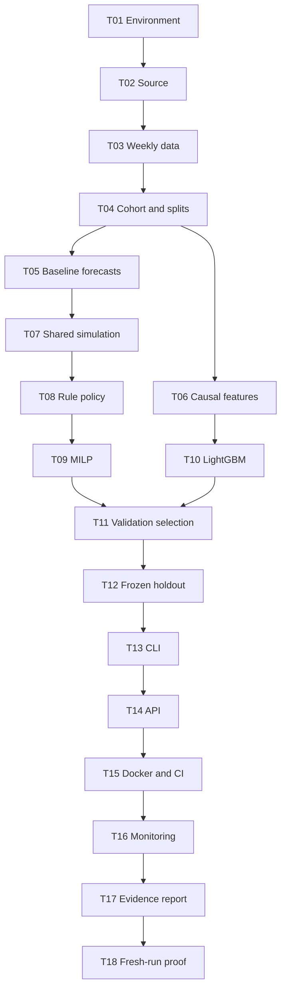

# DemandGuard implementation plan

## 1. Delivery approach

Finish a small, valid forecast-to-reorder workflow before model tuning or presentation work. Use the Markdown specifications as the contract and tasks/todo.md as the only task-status tracker.

Working estimate: **50-70 focused hours**, including investigation and corrections. At an assumed ten hours per week, this is roughly five to seven weeks. User availability and a start date are not confirmed; there is no fixed completion deadline.

## 2. Milestones and dependency order

| Phase | Tasks | Approximate effort | Outcome / exit gate |
| --- | --- | --- | --- |
| A: foundation and data | T01-T04 | 10-14 h | Locked environment, solver proof, cleaned panel and dated splits; G0/G1 |
| B: first usable slice | T05-T08 | 10-14 h | Baseline forecasts -> constrained rule -> tested historical simulation; G2 |
| C: optimisation and evidence | T09-T12 | 16-22 h | Valid MILP, bounded model comparison, frozen holdout; G3/G4/G5 |
| D: engineering delivery | T13-T16 | 10-14 h | CLI/API, Docker/CI and monitoring; G6 |
| E: handoff and local release | T17-T18 | 4-6 h | Measured report and fresh-run proof; G7 |

This graph identifies dependencies; it does not authorise automatic delegation. Work sequentially by default so shared data/configuration remains consistent.

## 3. Project-manager responsibilities

- At session start: check actual state, next ready task and current risk.
- At each checkpoint: confirm evidence and resolve failed gates before moving ahead.
- At session end: update task status, progress and any changed decisions.
- At weekly review if implementation spans weeks: compare remaining effort to availability; cut later UI/cloud options first.
- Treat performance and impact goals as hypotheses; never alter the holdout to meet a desired target.

## 4. Task scope

The detailed tasks in todo.md each name acceptance, verification, dependencies and 1-5 likely implementation files. Generated data/reports and routine progress updates are not counted as implementation files. Split a task if its actual change expands beyond one focused session or five implementation files.

## 5. Risk register

| ID | Risk | Impact | Early evidence and mitigation |
| --- | --- | --- | --- |
| R1 | Aggregate source cannot support SKU decisions | High | Retail benchmark chosen; source justification and geographic limit documented |
| R2 | Missing weeks, returns or ingestion duplicates distort sales | High | T02-T03 audit and exact quantity reconciliation |
| R3 | Cohort/feature/target leakage | High | T04/T06 future-mutation tests and dated cutoff assertions |
| R4 | Insufficient examples after 60-week warm-up | High | Require N>=100 and report per-fold training counts before M1 fitting |
| R5 | ML loses to seasonal or simple baselines | Medium | Keep all valid baselines and release the honest winner |
| R6 | Wrong delivery timing or capacity model | High | Shared simulator, tiny known optima and conservative first-order reservation |
| R7 | Unsupported PuLP/CBC or Linux runtime | High | Host solver smoke in T01; container solve in T15; pin actual versions |
| R8 | Unrealistic synthetic cost choices dominate conclusions | High | Report all parameters; compare budget stress cases; avoid real savings claims |
| R9 | Twelve-week test misses broader seasonal behaviour | Medium | Report exact dates and limited generalisation; no broad confidence claims |
| R10 | Scope grows into dashboard/cloud/ERP | Medium | PRD exclusions and local release stop condition |
| R11 | Repeated experimentation leaks final holdout | High | Freeze selection record; do not rerun selection using test outcomes |
| R12 | Schedule estimate misses actual effort | Medium | Re-estimate at checkpoints; document remaining work without inventing deadlines |

## 6. Decisions already made versus discoveries remaining

- Made: source direction, weekly grain, four horizons, maximum products, chronological protocol, model families, integer reorder timing and local delivery scope.
- Remaining empirical discoveries: actual data quality/cohort size, best model, inventory benefit, latency and portable solver installation.
- Scope does not depend on having the original chat open. Discoveries are recorded back into owning Markdown files.

## 7. Stop condition

Implementation stops at a verified local v0.1: mandatory requirements pass, final evidence is written and T18 proves reproduction. Additional models, interfaces or publishing require a new task scope. Planning ends when all handoff files exist, references resolve and the next implementation task is unambiguous.
